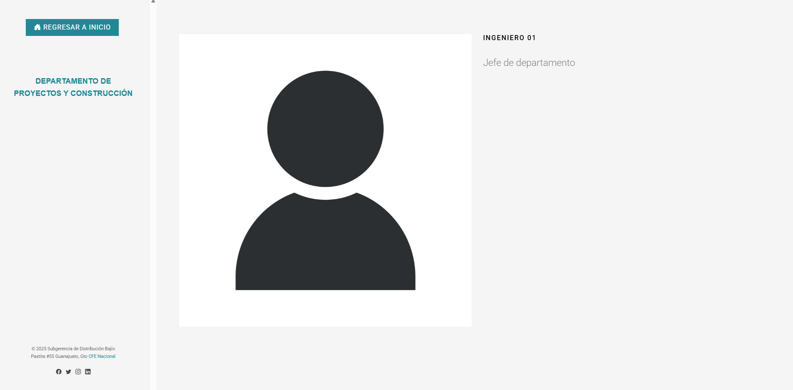

<h1>Department Management System - CFE Bajío Division</h1>

<section>
  <h2>🎯 General Description</h2>
  

    This system was developed for the <strong>Distribution Sub-management</strong> of the 
    <strong>Federal Electricity Commission (CFE) Bajío Division</strong>.  
    Its purpose is to centralize and organize departmental information, allowing both user access 
    to consult the data and internal management by administrators.
  

</section>

<section>
  <h2>🧭 Role and Methodology</h2>
  

    I developed and coordinated the project, defining the structure of the modules and functionalities, 
    while ensuring proper management of internal information.  
    Best development practices and version control were applied to guarantee quality and security.
  

</section>

<section>
  <h2>🧩 System Sections</h2>

  <h3>👥 User</h3>
  

    The user section allows consultation of information published by the administrative side.  
    It includes:
  

  <ul>
    <li>Organizational charts, links, and telephone extensions for each department.</li>
    <li>Duty schedules.</li>
    <li>Single-line diagram consultation.</li>
    <li>Departmental news and updates.</li>
  </ul>
  

    
    
    
    
    
    
    
  

  <h3>🛠️ Administrator</h3>
  

    The administrative section allows management of all internal system information.  
    Main functionalities:
  

  <ul>
    <li>Create and edit departments.</li>
    <li>Modify departmental information.</li>
    <li>Upload files related to single-line diagrams, schedules, and news updates.</li>
  </ul>
  

    
    
    
    
    
  

</section>

<section>
  <h2>⚙️ Technologies Used</h2>
  

    The system was developed using modern web technologies to ensure scalability and ease of maintenance.  
    Special attention was given to building robust REST APIs and implementing a concrete business logic 
    aligned with client requirements for proper compliance.
  

  

    PHP
    Laravel
    MySQL
    HTML5
    CSS3
    JavaScript
    REST API
  

</section>

<section>
  <h2>🚀 System Objective</h2>
  

    To centralize and organize departmental information, facilitating user consultation and enabling 
    efficient management by administrators, improving communication and data availability within 
    the CFE Bajío Division.
  

</section>

<footer>
  
Developed for the <strong>Distribution Sub-management, CFE Bajío Division</strong>

  
Project leadership and development: <strong>Ángel García Aguazul</strong>

</footer>

## About Laravel

Laravel is a web application framework with expressive, elegant syntax. We believe development must be an enjoyable and creative experience to be truly fulfilling. Laravel takes the pain out of development by easing common tasks used in many web projects, such as:

- [Simple, fast routing engine](https://laravel.com/docs/routing).
- [Powerful dependency injection container](https://laravel.com/docs/container).
- Multiple back-ends for [session](https://laravel.com/docs/session) and [cache](https://laravel.com/docs/cache) storage.
- Expressive, intuitive [database ORM](https://laravel.com/docs/eloquent).
- Database agnostic [schema migrations](https://laravel.com/docs/migrations).
- [Robust background job processing](https://laravel.com/docs/queues).
- [Real-time event broadcasting](https://laravel.com/docs/broadcasting).

Laravel is accessible, powerful, and provides tools required for large, robust applications.

## Learning Laravel

Laravel has the most extensive and thorough [documentation](https://laravel.com/docs) and video tutorial library of all modern web application frameworks, making it a breeze to get started with the framework.

You may also try the [Laravel Bootcamp](https://bootcamp.laravel.com), where you will be guided through building a modern Laravel application from scratch.

If you don't feel like reading, [Laracasts](https://laracasts.com) can help. Laracasts contains thousands of video tutorials on a range of topics including Laravel, modern PHP, unit testing, and JavaScript. Boost your skills by digging into our comprehensive video library.

## Laravel Sponsors

We would like to extend our thanks to the following sponsors for funding Laravel development. If you are interested in becoming a sponsor, please visit the [Laravel Partners program](https://partners.laravel.com).

### Premium Partners

- **[Vehikl](https://vehikl.com/)**
- **[Tighten Co.](https://tighten.co)**
- **[WebReinvent](https://webreinvent.com/)**
- **[Kirschbaum Development Group](https://kirschbaumdevelopment.com)**
- **[64 Robots](https://64robots.com)**
- **[Curotec](https://www.curotec.com/services/technologies/laravel/)**
- **[Cyber-Duck](https://cyber-duck.co.uk)**
- **[DevSquad](https://devsquad.com/hire-laravel-developers)**
- **[Jump24](https://jump24.co.uk)**
- **[Redberry](https://redberry.international/laravel/)**
- **[Active Logic](https://activelogic.com)**
- **[byte5](https://byte5.de)**
- **[OP.GG](https://op.gg)**

## Contributing

Thank you for considering contributing to the Laravel framework! The contribution guide can be found in the [Laravel documentation](https://laravel.com/docs/contributions).

## Code of Conduct

In order to ensure that the Laravel community is welcoming to all, please review and abide by the [Code of Conduct](https://laravel.com/docs/contributions#code-of-conduct).

## Security Vulnerabilities

If you discover a security vulnerability within Laravel, please send an e-mail to Taylor Otwell via [taylor@laravel.com](mailto:taylor@laravel.com). All security vulnerabilities will be promptly addressed.

## License

The Laravel framework is open-sourced software licensed under the [MIT license](https://opensource.org/licenses/MIT).
